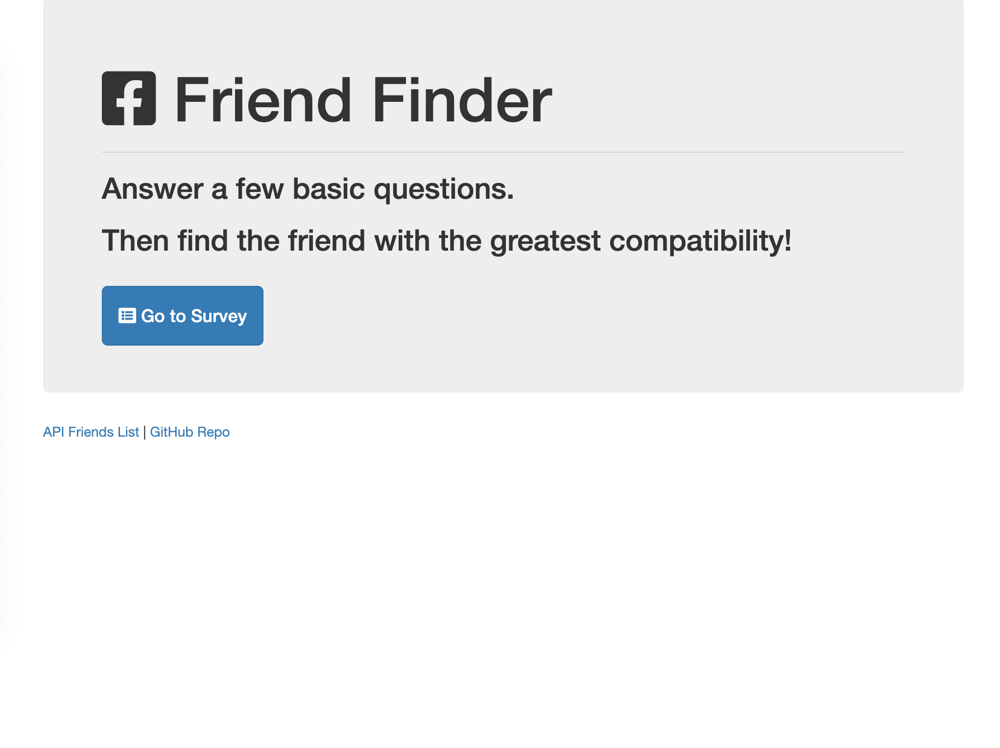
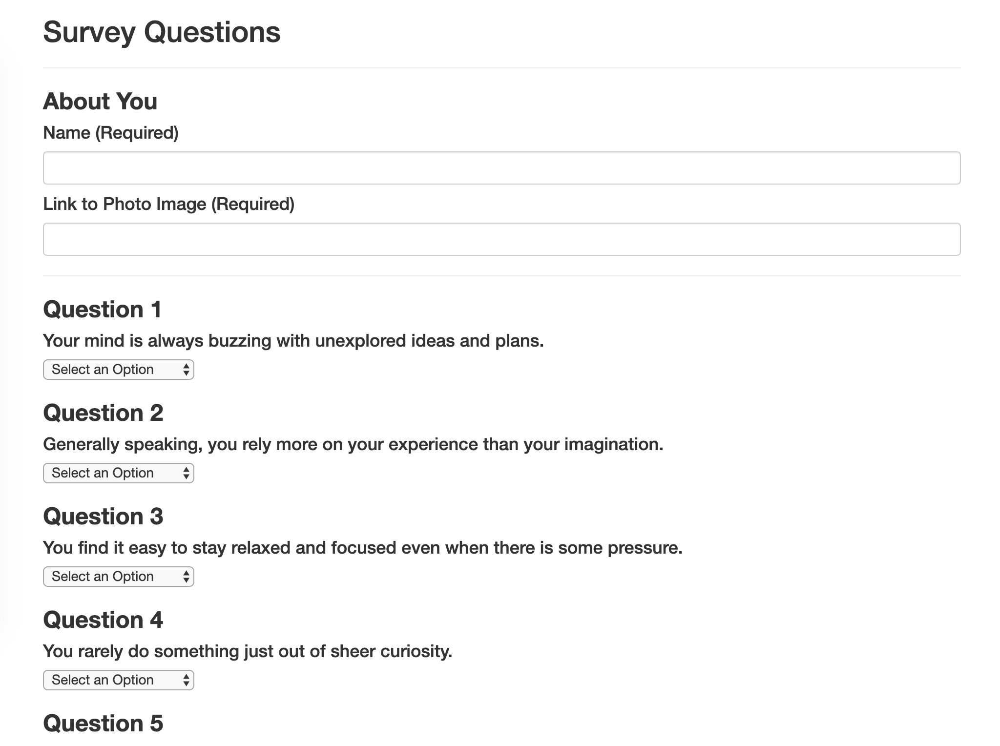

# Friend-Finder

## About
This is a full-stack app that will take in results from users' surveys, then compare their answers with those from other users. The app will then display the name and picture of the user with the best overall match.

## How to use
Enter information about yourself, name and a link to your photo. Answer the questions then submit. You'll get results on who you are the most compatible with, in a form of a name and photo of that person.

## Technologies Used
* Deployed with Heroku
* Node
* Express
* Node NPM packages: Express and body-parser 
* JavaScript
* Bootstrap
* HTML/CSS

## Developer Notes
This app has its own server-side API using the Express.js framework. Express is the most widely used Node.js server framework. It quickly allows us to easily establish our API route and associated HTTP request methods. Routing is how we design our server to handle responses when a client makes a request at a specific endpoint, or URL. This server will listen for a specific type of request at a specific endpoint and when it hears that request, it will respond accordingly. 

## Preview

